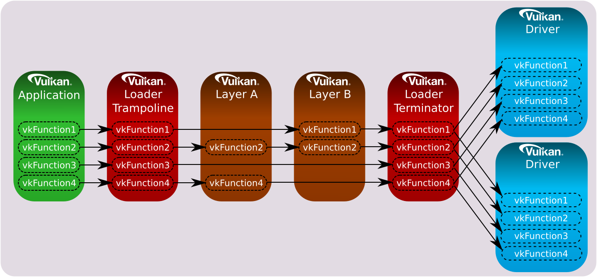
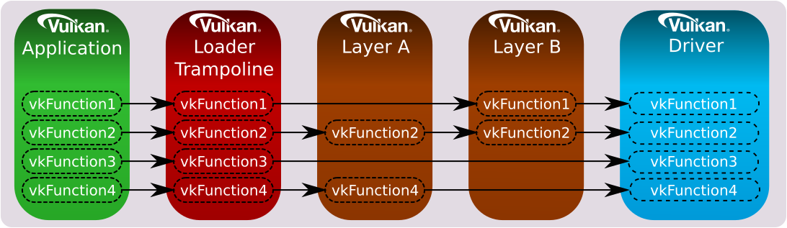

<!-- markdownlint-disable MD041 -->
[![Khronos Vulkan][1]][2]

[1]: https://vulkan.lunarg.com/img/Vulkan_100px_Dec16.png "https://www.khronos.org/vulkan/"
[2]: https://www.khronos.org/vulkan/

# Layer Interface to the Loader
[![Creative Commons][3]][4]

<!-- Copyright &copy; 2015-2021 LunarG, Inc. -->

[3]: https://i.creativecommons.org/l/by-nd/4.0/88x31.png "Creative Commons License"
[4]: https://creativecommons.org/licenses/by-nd/4.0/


## Table of Contents

* [Overview](#overview)
* [Layer Discovery](#layer-discovery)
  * [Layer Manifest File Usage](#layer-manifest-file-usage)
  * [Android Layer Discovery](#android-layer-discovery)
  * [Windows Layer Discovery](#windows-layer-discovery)
  * [Linux Layer Discovery](#linux-layer-discovery)
    * [Example Linux Implicit Layer Search Path](#example-linux-implicit-layer-search-path)
  * [Fuchsia Layer Discovery](#fuchsia-layer-discovery)
  * [macOS Layer Discovery](#macos-layer-discovery)
    * [Example macOS Implicit Layer Search Path](#example-macos-implicit-layer-search-path)
  * [Exception for Elevated Privileges](#exception-for-elevated-privileges)
* [Layer Version Negotiation](#layer-version-negotiation)
* [Layer Call Chains and Distributed Dispatch](#layer-call-chains-and-distributed-dispatch)
* [Layer Unknown Physical Device Extensions](#layer-unknown-physical-device-extensions)
* [Layer Intercept Requirements](#layer-intercept-requirements)
* [Distributed Dispatching Requirements](#distributed-dispatching-requirements)
* [Layer Conventions and Rules](#layer-conventions-and-rules)
* [Layer Dispatch Initialization](#layer-dispatch-initialization)
* [Example Code for CreateInstance](#example-code-for-createinstance)
* [Example Code for CreateDevice](#example-code-for-createdevice)
* [Meta-layers](#meta-layers)
* [Pre-Instance Functions](#pre-instance-functions)
* [Special Considerations](#special-considerations)
  * [Associating Private Data with Vulkan Objects Within a Layer](#associating-private-data-with-vulkan-objects-within-a-layer)
    * [Wrapping](#wrapping)
    * [Hash Maps](#hash-maps)
  * [Creating New Dispatchable Objects](#creating-new-dispatchable-objects)
* [Layer Manifest File Format](#layer-manifest-file-format)
  * [Layer Manifest File Version History](#layer-manifest-file-version-history)
* [Layer Interface Versions](#layer-interface-versions)
  * [Layer Interface Version 2](#layer-interface-api-version-2)
  * [Layer Interface Version 1](#layer-interface-api-version-1)
  * [Layer Interface Version 0](#layer-interface-api-version-0)


## Overview

This is the Layer-centric view of working with the Vulkan loader.
For the complete overview of all sections of the loader, please refer 
to the [LoaderInterfaceArchitecture.md](LoaderInterfaceArchitecture.md) file.


## Layer Discovery

As mentioned in the
[Implicit versus Explicit](LoaderApplicationInterface.md#implicit-vs-explicit-layers),
section of the
[LoaderApplicationInterface.md](LoaderApplicationInterface.md) document, layers
can be categorized into two categories:
 * Implicit Layers
 * Explicit Layers

The main difference between the two is that implicit layers are automatically
enabled, unless overridden, and explicit layers must be enabled.
Remember, implicit layers are not present on all Operating Systems (like
Android).

On any system, the loader looks in specific areas for information on the layers
that it can load at a user's request.
The process of finding the available layers on a system is known as Layer
Discovery.
During discovery, the loader determines what layers are available, the layer
name, the layer version, and any extensions supported by the layer.
This information is provided back to an application through
`vkEnumerateInstanceLayerProperties`.

The group of layers available to the loader is known as the `Layer Library`.
This section defines an extensible interface to discover what layers are
contained in the `Layer Library`.

This section also specifies the minimal conventions and rules a layer must
follow, especially with regards to interacting with the loader and other
layers.

When searching for a layer, the loader will look through the `Layer Library` in
the order it detected them and load the layer if the name matches.
If multiple instances of the same library exist in different locations
throughout the user's system, then the one appearing first in the search order
will be used.
Each OS has its own search order that is defined in its layer discovery
section below.
If multiple manifest files in the same directory define the same layer, but
point to different library files, the order which the layers is loaded is
[random due to the behavior of readdir](https://www.ibm.com/support/pages/order-directory-contents-returned-calls-readdir).

Additionally, any duplicate layer names in either the component layer list, or
globally among all enabled layers, during calls to `vkCreateInstance` or
`vkCreateDevice` will simply be ignored by the loader.
Only the first occurrence of any layer name will be used.


### Layer Manifest File Usage

On Windows, Linux, and macOS systems, JSON-formatted manifest files are used to
store layer information.
In order to find system-installed layers, the Vulkan loader will read the JSON
files to identify the names and attributes of layers and their extensions.
The use of manifest files allows the loader to avoid loading any shared library
files when the application does not query nor request any extensions.
The format of [Layer Manifest File](#layer-manifest-file-format) is detailed
below.

The Android loader does not use manifest files.
Instead, the loader queries the layer properties using special functions known
as "introspection" functions.
The intent of these functions is to determine the same required information
gathered from reading the manifest files.
These introspection functions are not used by the Khronos loader but should be
present in layers to maintain consistency.
The specific "introspection" functions are called out in the
[Layer Manifest File Format](#layer-manifest-file-format) table.


### Android Layer Discovery

On Android, the loader looks for layers to enumerate in the
`/data/local/debug/vulkan` folder.
An application enabled for debug has the ability to enumerate and enable any
layers in that location.


### Windows Layer Discovery

In order to find system-installed layers, the Vulkan loader will scan the
values in the following Windows registry keys:

```
HKEY_LOCAL_MACHINE\SOFTWARE\Khronos\Vulkan\ExplicitLayers
HKEY_CURRENT_USER\SOFTWARE\Khronos\Vulkan\ExplicitLayers
HKEY_LOCAL_MACHINE\SOFTWARE\Khronos\Vulkan\ImplicitLayers
HKEY_CURRENT_USER\SOFTWARE\Khronos\Vulkan\ImplicitLayers
```

Except when running a 32-bit application on 64-bit Windows, when the loader
will instead scan the 32-bit registry location:

```
HKEY_LOCAL_MACHINE\SOFTWARE\WOW6432Node\Khronos\Vulkan\ExplicitLayers
HKEY_CURRENT_USER\SOFTWARE\WOW6432Node\Khronos\Vulkan\ExplicitLayers
HKEY_LOCAL_MACHINE\SOFTWARE\WOW6432Node\Khronos\Vulkan\ImplicitLayers
HKEY_CURRENT_USER\SOFTWARE\WOW6432Node\Khronos\Vulkan\ImplicitLayers
```

For each value in these keys which has DWORD data set to 0, the loader opens
the JSON manifest file specified by the name of the value.
Each name must be an absolute path to the manifest file.
Additionally, the `HKEY_CURRENT_USER` locations will only be searched if an
application is not being executed with administrative privileges.
This is done to ensure that an application with administrative privileges does
not run layers that did not need administrator access to install.

Because some layers are installed alongside drivers, the loader will scan
through registry keys specific to Display Adapters and all Software Components
associated with these adapters for the locations of JSON manifest files.
These keys are located in device keys created during driver installation and
contain configuration information for base settings, including Vulkan, OpenGL,
and Direct3D ICD location.

The Device Adapter and Software Component key paths should be obtained through
the PnP Configuration Manager API.
The `000X` key will be a numbered key, where each device is assigned a
different number.

```
HKEY_LOCAL_MACHINE\System\CurrentControlSet\Control\Class\{Adapter GUID}\000X\VulkanExplicitLayers
HKEY_LOCAL_MACHINE\System\CurrentControlSet\Control\Class\{Adapter GUID}\000X\VulkanImplicitLayers
HKEY_LOCAL_MACHINE\System\CurrentControlSet\Control\Class\{Software Component GUID}\000X\VulkanExplicitLayers
HKEY_LOCAL_MACHINE\System\CurrentControlSet\Control\Class\{Software Component GUID}\000X\VulkanImplicitLayers
```

In addition, on 64-bit systems there may be another set of registry values,
listed below.
These values record the locations of 32-bit layers on 64-bit operating systems,
in the same way as the Windows-on-Windows functionality.

```
HKEY_LOCAL_MACHINE\System\CurrentControlSet\Control\Class\{Adapter GUID}\000X\VulkanExplicitLayersWow
HKEY_LOCAL_MACHINE\System\CurrentControlSet\Control\Class\{Adapter GUID}\000X\VulkanImplicitLayersWow
HKEY_LOCAL_MACHINE\System\CurrentControlSet\Control\Class\{Software Component GUID}\000X\VulkanExplicitLayersWow
HKEY_LOCAL_MACHINE\System\CurrentControlSet\Control\Class\{Software Component GUID}\000X\VulkanImplicitLayersWow
```

If any of the above values exist and is of type `REG_SZ`, the loader will open
the JSON manifest file specified by the key value.
Each value must be an absolute path to a JSON manifest file.
A key value may also be of type `REG_MULTI_SZ`, in which case the value will be
interpreted as a list of paths to JSON manifest files.

In general, applications should install layers into the
`SOFTWARE\Khronos\Vulkan` paths.
The PnP registry locations are intended specifically for layers that are
distributed as part of a driver installation.
An application installer should not modify the device-specific registries,
while a device driver should not modify the system registries.

The Vulkan loader will open each manifest file to obtain information about the
layer, including the name or pathname of a shared library (".dll") file.

If `VK_LAYER_PATH` is defined, then the loader will look at the paths defined by
that variable for explicit layer manifest files instead of using the information
provided by the explicit layer registry keys.

For security reasons, `VK_LAYER_PATH` is ignored if running with elevated
privileges.
See [Exception for Elevated Privileges](#exception-for-elevated-privileges)
for more info.

See
[Forcing Layer Source Folders](LoaderApplicationInterface.md#forcing-layer-source-folders)
in the [LoaderApplicationInterface.md document](LoaderApplicationInterface.md)
for more information on this.


### Linux Layer Discovery

On Linux, the Vulkan loader will scan for manifest files using environment
variables or corresponding fallback values if the corresponding environment
variable is not defined:

<table style="width:100%">
  <tr>
    <th>Search Order</th>
    <th>Directory/Environment Variable</th>
    <th>Fallback</th>
    <th>Additional Notes</th>
  </tr>
  <tr>
    <td>1</td>
    <td>$XDG_CONFIG_HOME</td>
    <td>$HOME/.config</td>
    <td><b>This path is ignored when running with elevated privileges such as
           setuid, setgid, or filesystem capabilities</b>.<br/>
        This is done because under these scenarios it is not safe to trust
        that the environment variables are non-malicious.
    </td>
  </tr>
  <tr>
    <td>1</td>
    <td>$XDG_CONFIG_DIRS</td>
    <td>/etc/xdg</td>
    <td></td>
  </tr>
  <tr>
    <td>2</td>
    <td>SYSCONFDIR</td>
    <td>/etc</td>
    <td>Compile-time option set to possible location of layers installed from
        non-Linux-distribution-provided packages.
    </td>
  </tr>
  <tr>
    <td>3</td>
    <td>EXTRASYSCONFDIR</td>
    <td>/etc</td>
    <td>Compile-time option set to possible location of layers installed from
        non-Linux-distribution-provided packages.
        Typically only set if SYSCONFDIR is set to something other than /etc
    </td>
  </tr>
  <tr>
    <td>4</td>
    <td>$XDG_DATA_HOME</td>
    <td>$HOME/.local/share</td>
    <td><b>This path is ignored when running with elevated privileges such as
           setuid, setgid, or filesystem capabilities</b>.<br/>
        This is done because under these scenarios it is not safe to trust
        that the environment variables are non-malicious.
    </td>
  </tr>
  <tr>
    <td>5</td>
    <td>$XDG_DATA_DIRS</td>
    <td>/usr/local/share/:/usr/share/</td>
    <td></td>
  </tr>
</table>

The directory lists are concatenated together using the standard platform path
separator (:).
The loader then selects each path, and applies a suffix onto it for the specific
type of layer being searched for and looks in that specific folder for
manifest files:

  * Implicit Layers:  Suffix =  /vulkan/implicit_layer.d
  * Explicit Layers:  Suffix =  /vulkan/explicit_layer.d

If `VK_LAYER_PATH` is defined, then the loader will look at the paths defined by
that variable for explicit layer manifest files instead of using the information
provided by the explicit layer paths.

For security reasons, `VK_LAYER_PATH` is ignored if running with elevated
privileges.
See [Exception for Elevated Privileges](#exception-for-elevated-privileges)
for more info.

**NOTE** While the order of folders searched for manifest files is well
defined, the order contents are read by the loader in each directory is
[random due to the behavior of readdir](https://www.ibm.com/support/pages/order-directory-contents-returned-calls-readdir).

See
[Forcing Layer Source Folders](LoaderApplicationInterface.md#forcing-layer-source-folders)
in the [LoaderApplicationInterface.md document](LoaderApplicationInterface.md)
for more information on this.

It is also important to note that while `VK_LAYER_PATH` will point the loader
to finding the manifest files, it does not guarantee the library files mentioned
by the manifest will immediately be found.
Often, the layer manifest file will point to the library file using a relative
or absolute path.
When a relative or absolute path is used, the loader can typically find the
library file without querying the operating system.
However, if a library is listed only by name, the loader may not find it.
If problems occur finding a library file associated with a layer, try updating
the `LD_LIBRARY_PATH` environment variable to point at the location of the
corresponding `.so` file.


#### Example Linux Explicit Layer Search Path

For a fictional user "me" the layer manifest search path might look like the
following:

```
  /home/me/.config/vulkan/explicit_layer.d
  /etc/xdg/vulkan/explicit_layer.d
  /usr/local/etc/vulkan/explicit_layer.d
  /etc/vulkan/explicit_layer.d
  /home/me/.local/share/vulkan/explicit_layer.d
  /usr/local/share/vulkan/explicit_layer.d
  /usr/share/vulkan/explicit_layer.d
```

### Fuchsia Layer Discovery

On Fuchsia, the Vulkan loader will scan for manifest files using environment
variables or corresponding fallback values if the corresponding environment
variable is not defined in the same way as [Linux](#linux-layer-discovery).
The **only** difference is that Fuchsia does not allow fallback values for
*$XDG_DATA_DIRS* or *$XDG_HOME_DIRS*.


### macOS Layer Discovery

On macOS, the Vulkan loader will scan for manifest files using the application
resource folder as well as environment variables or corresponding fallback
values if the corresponding environment variable is not defined.
The order is similar to the search path on Linux with the exception that
the application's bundle resources are searched first:
`(bundle)/Contents/Resources/`.

#### Example macOS Implicit Layer Search Path

For a fictional user "Me" the layer manifest search path might look like the
following:

```
  <bundle>/Contents/Resources/vulkan/implicit_layer.d
  /Users/Me/.config/vulkan/implicit_layer.d
  /etc/xdg/vulkan/implicit_layer.d
  /usr/local/etc/vulkan/implicit_layer.d
  /etc/vulkan/implicit_layer.d
  /Users/Me/.local/share/vulkan/implicit_layer.d
  /usr/local/share/vulkan/implicit_layer.d
  /usr/share/vulkan/implicit_layer.d
```

### Exception for Elevated Privileges

There is an exception to when `VK_LAYER_PATH` is available for use.
For security reasons, `VK_LAYER_PATH` is ignored if running the Vulkan
application with elevated privileges.
Because of this, `VK_LAYER_PATH` can only be used for applications that do not
use elevated privileges.

For more information see
[Elevated Privilege Caveats](LoaderInterfaceArchitecture.md#elevated-privilege-caveats)
in the top-level
[LoaderInterfaceArchitecture.md][LoaderInterfaceArchitecture.md] document.

## Layer Version Negotiation

Now that a layer has been discovered, an application can choose to load it, or
in the case of implicit layers, it can be loaded by default.
When the loader attempts to load the layer, the first thing it does is attempt
to negotiate the version of the loader to layer interface.
In order to negotiate the loader/layer interface version, the layer must
implement the `vkNegotiateLoaderLayerInterfaceVersion` function.
The following information is provided for this interface in
include/vulkan/vk_layer.h:

```cpp
typedef enum VkNegotiateLayerStructType {
    LAYER_NEGOTIATE_INTERFACE_STRUCT = 1,
} VkNegotiateLayerStructType;

typedef struct VkNegotiateLayerInterface {
    VkNegotiateLayerStructType sType;
    void *pNext;
    uint32_t loaderLayerInterfaceVersion;
    PFN_vkGetInstanceProcAddr pfnGetInstanceProcAddr;
    PFN_vkGetDeviceProcAddr pfnGetDeviceProcAddr;
    PFN_GetPhysicalDeviceProcAddr pfnGetPhysicalDeviceProcAddr;
} VkNegotiateLayerInterface;

VkResult
   vkNegotiateLoaderLayerInterfaceVersion(
      VkNegotiateLayerInterface *pVersionStruct);
```

The `VkNegotiateLayerInterface` structure is similar to other Vulkan structures.
The "sType" field, in this case takes a new enum defined just for internal
loader/layer interfacing use.
The valid values for "sType" could grow in the future, but right now only
has the one value "LAYER_NEGOTIATE_INTERFACE_STRUCT".

This function (`vkNegotiateLoaderLayerInterfaceVersion`) should be exported by
the layer so that using "GetProcAddress" on Windows or "dlsym" on Linux or
macOS, should return a valid function pointer to it.
Once the loader has grabbed a valid address to the layers function, the loader
will create a variable of type `VkNegotiateLayerInterface` and initialize it
in the following ways:
 1. Set the structure "sType" to "LAYER_NEGOTIATE_INTERFACE_STRUCT"
 2. Set pNext to NULL.
     - This is for future growth
 3. Set "loaderLayerInterfaceVersion" to the current version the loader desires
to set the interface to.
      - The minimum value sent by the loader will be 2 since it is the first
version supporting this function.

The loader will then individually call each layer’s
`vkNegotiateLoaderLayerInterfaceVersion` function with the filled out
“VkNegotiateLayerInterface”.

This function allows the loader and layer to agree on an interface version to
use.
The "loaderLayerInterfaceVersion" field is both an input and output parameter.
"loaderLayerInterfaceVersion" is filled in by the loader with the desired
latest interface version supported by the loader (typically the latest).
The layer receives this and returns back the version it desires in the same
field.
Because it is setting up the interface version between the loader and layer,
this should be the first call made by a loader to the layer (even prior to any
calls to `vkGetInstanceProcAddr`).

If the layer receiving the call no longer supports the interface version
provided by the loader (due to deprecation), then it should report a
`VK_ERROR_INITIALIZATION_FAILED` error.
Otherwise it sets the value pointed by "loaderLayerInterfaceVersion" to the
latest interface version supported by both the layer and the loader and returns
`VK_SUCCESS`.

The layer should report `VK_SUCCESS` in case the loader-provided interface
version is newer than that supported by the layer, as it's the loader's
responsibility to determine whether it can support the older interface version
supported by the layer.
The layer should also report `VK_SUCCESS` in the case its interface version is
greater than the loader's, but return the loader's version.
Thus, upon return of `VK_SUCCESS` the "loaderLayerInterfaceVersion" will contain
the desired interface version to be used by the layer.

If the loader receives `VK_ERROR_INITIALIZATION_FAILED` instead of `VK_SUCCESS`,
then the loader will treat the layer as unusable and will not load it.
In this case, the application will not see the layer during enumeration.
*Note that the loader is currently backwards compatible with all layer
interface versions, so a layer should not be able to request a version
older than what the loader supports.*

This function **MUST NOT** call down the layer chain to the next layer.
The loader will work with each layer individually.

If the layer supports the new interface and reports version 2 or greater, then
The layer should fill in the function pointer values to its internal
functions:
    - "pfnGetInstanceProcAddr" should be set to the layer’s internal
`GetInstanceProcAddr` function.
    - "pfnGetDeviceProcAddr" should be set to the layer’s internal
`GetDeviceProcAddr` function.
    - "pfnGetPhysicalDeviceProcAddr" should be set to the layer’s internal
`GetPhysicalDeviceProcAddr` function.
      - If the layer supports no physical device extensions, it may set the
value to NULL.
      - More on this function later
the loader will use the “fpGetInstanceProcAddr” and “fpGetDeviceProcAddr”
functions from the “VkNegotiateLayerInterface” structure.
Prior to these changes, the loader would query each of those functions using
"GetProcAddress" on Windows or "dlsym" on Linux or macOS.


## Layer Call Chains and Distributed Dispatch

There are two key architectural features that drive the loader to
`Layer Library` interface:
 1. Separate and distinct instance and device call chains
 2. Distributed dispatch.

For further information, read the overview of dispatch tables and call chains
above in the
[Dispatch Tables and Call Chains](LoaderInterfaceArchitecture.md#dispatch-tables-and-call-chains)
section of the
[LoaderInterfaceArchitecture.md document](LoaderInterfaceArchitecture.md).

What's important to note here is that a layer can intercept Vulkan instance
functions, device functions or both.
For a layer to intercept instance functions, it must participate in the
instance call chain.
For a layer to intercept device functions, it must participate in the device
call chain.

Remember, a layer does not need to intercept all instance or device functions,
instead, it can choose to intercept only a subset of those functions.

Normally, when a layer intercepts a given Vulkan function, it will call down
the instance or device call chain as needed.
The loader and all layer libraries that participate in a call chain cooperate
to ensure the correct sequencing of calls from one entity to the next.
This group effort for call chain sequencing is hereinafter referred to as
**distributed dispatch**.

In distributed dispatch each layer is responsible for properly calling the next
entity in the call chain.
This means that a dispatch mechanism is required for all Vulkan functions that
a layer intercepts.
If a Vulkan function is not intercepted by a layer, or if a layer chooses to
terminate the function by not calling down the chain, then no dispatch is
needed for that particular function.

For example, if the enabled layers intercepted only certain instance functions,
the call chain would look as follows:


Likewise, if the enabled layers intercepted only a few of the device functions,
the call chain could look this way:


The loader is responsible for dispatching all core and instance extension Vulkan
functions to the first entity in the call chain.


## Layer Unknown Physical Device Extensions

Originally, if `vkGetInstanceProcAddr` was called in the loader, it would
result in the following behavior:
 1. The loader would check if core function:
    - If it was, it would return the function pointer
 2. The loader would check if known extension function:
    - If it was, it would return the function pointer
 3. If the loader knew nothing about it, it would call down using
`GetInstanceProcAddr`
    - If it returned non-NULL, treat it as an unknown logical device command.
    - This meant setting up a generic trampoline function that takes in a
VkDevice as the first parameter and adjusting the dispatch table to call the
Driver/Layer's function after getting the dispatch table from the `VkDevice`.
 4. If all the above failed, the loader would return NULL to the application.

This caused problems when a layer attempted to expose new physical device
extensions the loader knew nothing about, but an application did.
Because the loader knew nothing about it, the loader would get to step 3 in the
above process and would treat the function as an unknown logical device
command.
The problem is, this would create a generic VkDevice trampoline function which,
on the first call, would attempt to dereference the VkPhysicalDevice as a
VkDevice.
This would lead to a crash or corruption.

In order to identify the extension entry-points specific to physical device
extensions, the following function can be added to a layer:

```cpp
PFN_vkVoidFunction
   vk_layerGetPhysicalDeviceProcAddr(
      VkInstance instance,
      const char* pName);
```

This function behaves similar to `vkGetInstanceProcAddr` and
`vkGetDeviceProcAddr` except it should only return values for physical device
extension entry-points.
In this way, it compares "pName" to every physical device function supported
in the layer.

The following rules apply:
  * If it is the name of a physical device function supported by the layer,
the pointer to the layer's corresponding function should be returned.
  * If it is the name of a valid function which is **not** a physical device
function (i.e. an instance, device, or other function implemented by the
layer), then the value of NULL should be returned.
    * The layer doesn't call down since the command is not a physical device
 extension.
  * If the layer has no idea what this function is, it should call down the
layer chain to the next `vk_layerGetPhysicalDeviceProcAddr` call.
    * This can be retrieved in one of two ways:
      * During `vkCreateInstance`, it is passed to a layer in the chain
information passed to a layer in the `VkLayerInstanceCreateInfo` structure.
        * Use `get_chain_info()` to get the pointer to the
`VkLayerInstanceCreateInfo` structure.  Let's call it chain_info.
        * The address is then under
chain_info->u.pLayerInfo->pfnNextGetPhysicalDeviceProcAddr
        * See
[Example Code for CreateInstance](#example-code-for-createinstance)
      * Using the next layer’s `GetInstanceProcAddr` function to query for
`vk_layerGetPhysicalDeviceProcAddr`.

This support is optional and should not be considered a requirement.
This is only required if a layer intends to support some functionality not
directly supported by loaders released in the public.
If a layer does implement this support, it should return the address of its
`vk_layerGetPhysicalDeviceProcAddr` function in the
"pfnGetPhysicalDeviceProcAddr" member of the `VkNegotiateLayerInterface`
structure during [Layer Version Negotiation](#layer-version-negotiation).
Additionally, the layer should also make sure `vkGetInstanceProcAddr` returns a
valid function pointer to a query of `vk_layerGetPhysicalDeviceProcAddr`.

The new behavior of the loader's `vkGetInstanceProcAddr` with support for the
`vk_layerGetPhysicalDeviceProcAddr` function is as follows:
 1. Check if core function:
    - If it is, return the function pointer
 2. Check if known instance or device extension function:
    - If it is, return the function pointer
 3. Call the layer/driver `GetPhysicalDeviceProcAddr`
    - If it returns non-NULL, return a trampoline to a generic physical device
function, and set up a generic terminator which will pass it to the proper
driver.
 4. Call down using `GetInstanceProcAddr`
    - If it returns non-NULL, treat it as an unknown logical device command.
This means setting up a generic trampoline function that takes in a `VkDevice` as
the first parameter and adjusting the dispatch table to call the
driver/layer's function after getting the dispatch table from the `VkDevice`.
Then, return the pointer to corresponding trampoline function.
 5. Return NULL

Then, if the command gets promoted to core later, it will no
longer be set up using `vk_layerGetPhysicalDeviceProcAddr`.
Additionally, if the loader adds direct support for the extension, it will no
longer get to step 3, because step 2 will return a valid function pointer.
However, the layer should continue to support the command query via
`vk_layerGetPhysicalDeviceProcAddr`, until at least a Vulkan version bump,
because an older loader may still be attempting to use the commands.


## Layer Intercept Requirements

  * Layers intercept a Vulkan function by defining a C/C++ function with
signature **identical** to the Vulkan API for that function.
  * A layer **must intercept at least** `vkGetInstanceProcAddr` and
`vkCreateInstance` to participate in the instance call chain.
  * A layer **may also intercept** `vkGetDeviceProcAddr` and `vkCreateDevice`
to participate in the device call chain.
  * For any Vulkan function a layer intercepts which has a non-void return
value, **an appropriate value must be returned** by the layer intercept
function.
  * Most functions a layer intercepts **should call down the chain** to the
corresponding Vulkan function in the next entity.
    * The common behavior for a layer is to intercept a call, perform some
behavior, then pass it down to the next entity.
      * If a layer doesn't pass the information down, undefined behavior may occur.
      * This is because the function will not be received by layers further
down the chain, or any drivers.
    * One function that **must never call down the chain** is:
      * `vkNegotiateLoaderLayerInterfaceVersion`
    * Three common functions that **may not call down the chain** are:
      * `vkGetInstanceProcAddr`
      * `vkGetDeviceProcAddr`
      * `vk_layerGetPhysicalDeviceProcAddr`
      * These functions only call down the chain for Vulkan functions that they
do not intercept.
  * Layer intercept functions **may insert extra calls** to Vulkan functions in
addition to the intercept.
    * For example, a layer intercepting `vkQueueSubmit` may want to add a call
to `vkQueueWaitIdle` after calling down the chain for `vkQueueSubmit`.
    * This would result in two calls down the chain: First a call down the
`vkQueueSubmit` chain, followed by a call down the `vkQueueWaitIdle` chain.
    * Any additional calls inserted by a layer must be on the same chain
      * If the function is a device function, only other device functions
should be added.
      * Likewise, if the function is an instance function, only other instance
functions should be added.


## Distributed Dispatching Requirements

- For each entry-point a layer intercepts, it must keep track of the
entry-point residing in the next entity in the chain it will call down into.
  * In other words, the layer must have a list of pointers to functions of the
appropriate type to call into the next entity.
  * This can be implemented in various ways but
for clarity, will be referred to as a dispatch table.
- A layer can use the `VkLayerDispatchTable` structure as a device dispatch
table (see include/vulkan/vk_dispatch_table_helper.h).
- A layer can use the `VkLayerInstanceDispatchTable` structure as a instance
dispatch table (see include/vulkan/vk_dispatch_table_helper.h).
- A Layer's `vkGetInstanceProcAddr` function uses the next entity's
`vkGetInstanceProcAddr` to call down the chain for unknown (i.e.
non-intercepted) functions.
- A Layer's `vkGetDeviceProcAddr` function uses the next entity's
`vkGetDeviceProcAddr` to call down the chain for unknown (i.e. non-intercepted)
functions.
- A Layer's `vk_layerGetPhysicalDeviceProcAddr` function uses the next entity's
`vk_layerGetPhysicalDeviceProcAddr` to call down the chain for unknown (i.e.
non-intercepted) functions.


## Layer Conventions and Rules

A layer, when inserted into an otherwise compliant Vulkan driver, <b>must</b>
still result in a compliant Vulkan driver.
The intention is for layers to have a well-defined baseline behavior.
Therefore, it must follow some conventions and rules defined below.

In order for layers to have unique names, and reduce the chance of conflicts
that could occur when the loader attempts to load these layers, layers
<b>must</b> adhere to the following naming standard:
 * Start with `VK_LAYER_` prefix
 * Follow the prefix with either an organization or company name (LunarG),
   a unique company identifier (NV for Nvidia) or a software product name
   (RenderDoc) in ALL CAPS
 * Follow that with the specific name of the layer (typically lower-case but not
   required to be)
   * NOTE: The specific name, if more than one word, <b>must</b> be underscore
     delimited

Examples of valid layer names include:
 * <b>VK_LAYER_KHRONOS_validation</b>
   * Organization = "KHRONOS"
   * Specific name = "validation"
 * <b>VK_LAYER_RENDERDOC_Capture</b>
   * Application = "RENDERDOC"
   * Specific name = "Capture"
 * <b>VK_LAYER_VALVE_steam_fossilize_32</b>
   * Organization = "VALVE"
   * Application = "steam"
   * Specific name = "fossilize"
   * OS-modifier = "32"  (for 32-bit version)
 * <b>VK_LAYER_NV_nsight</b>
   * Organization Acronym = "NV" (for Nvidia)
   * Specific name = "nsight"
 
More details on layer naming can be found in the
[Vulkan style-guide](https://www.khronos.org/registry/vulkan/specs/1.2/styleguide.html#extensions-naming-conventions)
under section 3.4 "Version, Extension, and Layer Naming Conventions".

A layer is always chained with other layers.
It must not make invalid calls to, or rely on undefined behaviors of, its lower
layers.
When it changes the behavior of a function, it must make sure its upper layers
do not make invalid calls to or rely on undefined behaviors of its lower layers
because of the changed behavior.
For example, when a layer intercepts an object creation function to wrap the
objects created by its lower layers, it must make sure its lower layers never
see the wrapping objects, directly from itself or indirectly from its upper
layers.

When a layer requires host memory, it may ignore the provided allocators.
It is preferred that the layer use any provided memory allocators if the layer
is intended to run in a production environment.
For example, this usually applies to implicit layers that are always enabled.
That will allow applications to include the layer's memory usage.

Additional rules include:
  - `vkEnumerateInstanceLayerProperties` **must** enumerate and **only**
enumerate the layer itself.
  - `vkEnumerateInstanceExtensionProperties` **must** handle the case where
`pLayerName` is itself.
    - It **must** return `VK_ERROR_LAYER_NOT_PRESENT` otherwise, including when
`pLayerName` is `NULL`.
  - `vkEnumerateDeviceLayerProperties` **is deprecated and may be omitted**.
    - Using this will result in undefined behavior.
  - `vkEnumerateDeviceExtensionProperties` **must** handle the case where
`pLayerName` is itself.
    - In other cases, it should chain to other layers.
  - `vkCreateInstance` **must not** generate an error for unrecognized layer
names and extension names.
    - It may assume the layer names and extension names have been validated.
  - `vkGetInstanceProcAddr` intercepts a Vulkan function by returning a local
entry-point
    - Otherwise it returns the value obtained by calling down the instance call
chain.
  - `vkGetDeviceProcAddr` intercepts a Vulkan function by returning a local
entry-point
    - Otherwise it returns the value obtained by calling down the device call
chain.
    - These additional functions must be intercepted if the layer implements
device-level call chaining:
      - `vkGetDeviceProcAddr`
      - `vkCreateDevice`(only required for any device-level chaining)
         - **NOTE:** older layer libraries may expect that
           `vkGetInstanceProcAddr`
ignore `instance` when `pName` is `vkCreateDevice`.
  - The specification **requires** `NULL` to be returned from
`vkGetInstanceProcAddr` and `vkGetDeviceProcAddr` for disabled functions.
    - A layer may return `NULL` itself or rely on the following layers to do so.


## Layer Dispatch Initialization

- A layer initializes its instance dispatch table within its `vkCreateInstance`
function.
- A layer initializes its device dispatch table within its `vkCreateDevice`
function.
- The loader passes a linked list of initialization structures to layers via
the "pNext" field in the `VkInstanceCreateInfo` and `VkDeviceCreateInfo`
structures for `vkCreateInstance` and `VkCreateDevice` respectively.
- The head node in this linked list is of type `VkLayerInstanceCreateInfo` for
instance and VkLayerDeviceCreateInfo for device.
See file `include/vulkan/vk_layer.h` for details.
- A VK_STRUCTURE_TYPE_LOADER_INSTANCE_CREATE_INFO is used by the loader for the
"sType" field in `VkLayerInstanceCreateInfo`.
- A VK_STRUCTURE_TYPE_LOADER_DEVICE_CREATE_INFO is used by the loader for the
"sType" field in `VkLayerDeviceCreateInfo`.
- The "function" field indicates how the union field "u" should be interpreted
within `VkLayer*CreateInfo`.
The loader will set the "function" field to VK_LAYER_LINK_INFO.
This indicates "u" field should be `VkLayerInstanceLink` or
`VkLayerDeviceLink`.
- The `VkLayerInstanceLink` and `VkLayerDeviceLink` structures are the list
nodes.
- The `VkLayerInstanceLink` contains the next entity's `vkGetInstanceProcAddr`
used by a layer.
- The `VkLayerDeviceLink` contains the next entity's `vkGetInstanceProcAddr`
and `vkGetDeviceProcAddr` used by a layer.
- Given the above structures set up by the loader, layer must initialize their
dispatch table as follows:
  - Find the `VkLayerInstanceCreateInfo`/`VkLayerDeviceCreateInfo` structure in
the `VkInstanceCreateInfo`/`VkDeviceCreateInfo` structure.
  - Get the next entity's vkGet*ProcAddr from the "pLayerInfo" field.
  - For CreateInstance get the next entity's `vkCreateInstance` by calling the
"pfnNextGetInstanceProcAddr":
     pfnNextGetInstanceProcAddr(NULL, "vkCreateInstance").
  - For CreateDevice get the next entity's `vkCreateDevice` by calling the
"pfnNextGetInstanceProcAddr":
pfnNextGetInstanceProcAddr(instance, "vkCreateDevice"), passing the
already created instance handle.
  - Advanced the linked list to the next node: pLayerInfo = pLayerInfo->pNext.
  - Call down the chain either `vkCreateDevice` or `vkCreateInstance`
  - Initialize the layer dispatch table by calling the next entity's
Get*ProcAddr function once for each Vulkan function needed in the dispatch
table

## Example Code for CreateInstance

```cpp
VkResult
   vkCreateInstance(
      const VkInstanceCreateInfo *pCreateInfo,
      const VkAllocationCallbacks *pAllocator,
      VkInstance *pInstance)
{
   VkLayerInstanceCreateInfo *chain_info =
        get_chain_info(pCreateInfo, VK_LAYER_LINK_INFO);

    assert(chain_info->u.pLayerInfo);
    PFN_vkGetInstanceProcAddr fpGetInstanceProcAddr =
        chain_info->u.pLayerInfo->pfnNextGetInstanceProcAddr;
    PFN_vkCreateInstance fpCreateInstance =
        (PFN_vkCreateInstance)fpGetInstanceProcAddr(NULL, "vkCreateInstance");
    if (fpCreateInstance == NULL) {
        return VK_ERROR_INITIALIZATION_FAILED;
    }

    // Advance the link info for the next element of the chain.
    // This ensures that the next layer gets it's layer info and not
    // the info for our current layer.
    chain_info->u.pLayerInfo = chain_info->u.pLayerInfo->pNext;

    // Continue call down the chain
    VkResult result = fpCreateInstance(pCreateInfo, pAllocator, pInstance);
    if (result != VK_SUCCESS)
        return result;

    // Init layer's dispatch table using GetInstanceProcAddr of
    // next layer in the chain.
    instance_dispatch_table = new VkLayerInstanceDispatchTable;
    layer_init_instance_dispatch_table(
        *pInstance, my_data->instance_dispatch_table, fpGetInstanceProcAddr);

    // Other layer initialization
    ...

    return VK_SUCCESS;
}
```

## Example Code for CreateDevice

```cpp
VkResult
   vkCreateDevice(
      VkPhysicalDevice gpu,
      const VkDeviceCreateInfo *pCreateInfo,
      const VkAllocationCallbacks *pAllocator,
      VkDevice *pDevice)
{
    VkInstance instance = GetInstanceFromPhysicalDevice(gpu);
    VkLayerDeviceCreateInfo *chain_info =
        get_chain_info(pCreateInfo, VK_LAYER_LINK_INFO);

    PFN_vkGetInstanceProcAddr fpGetInstanceProcAddr =
        chain_info->u.pLayerInfo->pfnNextGetInstanceProcAddr;
    PFN_vkGetDeviceProcAddr fpGetDeviceProcAddr =
        chain_info->u.pLayerInfo->pfnNextGetDeviceProcAddr;
    PFN_vkCreateDevice fpCreateDevice =
        (PFN_vkCreateDevice)fpGetInstanceProcAddr(instance, "vkCreateDevice");
    if (fpCreateDevice == NULL) {
        return VK_ERROR_INITIALIZATION_FAILED;
    }

    // Advance the link info for the next element on the chain.
    // This ensures that the next layer gets it's layer info and not
    // the info for our current layer.
    chain_info->u.pLayerInfo = chain_info->u.pLayerInfo->pNext;

    VkResult result = fpCreateDevice(gpu, pCreateInfo, pAllocator, pDevice);
    if (result != VK_SUCCESS) {
        return result;
    }

    // initialize layer's dispatch table
    device_dispatch_table = new VkLayerDispatchTable;
    layer_init_device_dispatch_table(
        *pDevice, device_dispatch_table, fpGetDeviceProcAddr);

    // Other layer initialization
    ...

    return VK_SUCCESS;
}
```
In this case the function `GetInstanceFromPhysicalDevice` is called to get the
instance handle.
In practice, this would be done by any method a layer chooses to get an
instance handle from the physical device.


## Meta-layers

Meta-layers are a special kind of layer which is only available through the
Khronos loader.
While normal layers are associated with one particular library, a meta-layer
is actually a collection layer which contains an ordered list of other layers
(called component layers).

The benefits of a meta-layer are:
 1. More than one layer may be activated using a single layer name by simply
grouping multiple layers in a meta-layer.
 2. The order of individual component layers is loaded can be defined within
the meta-layer.
 3. Layer configurations (internal to the meta-layer manifest file) can easily
be shared with others.
 4. The loader will automatically collate all instance and device extensions in
a meta-layer's component layers, and report them as the meta-layer's properties
to the application when queried.

Restrictions to defining and using a meta-layer are:
 1. A Meta-layer Manifest file **must** be a properly formatted that contains
one or more component layers.
 3. All component layers **must be** present on a system for the meta-layer to
be used.
 4. All component layers **must be** at the same Vulkan API major and minor
version for the meta-layer to be used.

The ordering of a meta-layer's component layers in the instance or device call-
chain is simple:
  * The first layer listed will be the layer closest to the application.
  * The last layer listed will be the layer closest to the drivers.

Inside the meta-layer Manifest file, each component layer is listed by its
layer name.
This is the "name" tag's value associated with each component layer's Manifest
file under the "layer" or "layers" tag.
This is also the name that would normally be used when activating a layer
during `vkCreateInstance`.

Any duplicate layer names in either the component layer list, or globally among
all enabled layers, will simply be ignored by the loader.
Only the first instance of any layer name will be used.

For example, if a layer is enabled using the environment variable
`VK_INSTANCE_LAYERS` and have that same layer listed in a meta-layer, then the
environment-variable-enabled layer will be used and the component layer will
be dropped.
Likewise, if a person were to enable a meta-layer and then separately enable
one of the component layers afterwards, the second instantiation of the layer
name would be ignored.

The Manifest file formatting necessary to define a meta-layer can be found in
the [Layer Manifest File Format](#layer-manifest-file-format) section.

### Override Meta-Layer

If an implicit meta-layer was found on the system with the name
`VK_LAYER_LUNARG_override`, the loader uses it as an 'override' layer.
This is used to selectively enable and disable other layers from being loaded.
It can be applied globally or to a specific application or applications.
Disabling layers and specifying the application requires the layer manifest
have the following keys:
  * `blacklisted_layers` - List of explicit layer names that should not be
loaded even if requested by the application.
  * `app_keys` - List of paths to executables that the override layer applies
to.
When an application starts up and the override layer is present, the loader
first checks to see if the application is in the list.
If it isn't, the override layer is not applied.
If the list is empty or if `app_keys` doesn't exist, the loader makes the
override layer global and applies it to every application upon startup.

The override meta-layer is primarily enabled when using the
[VkConfig](https://github.com/LunarG/VulkanTools/blob/master/vkconfig/README.md)
tool included in the Vulkan SDK.
It is typically only available while the VkConfig tool is actually executing.
Please refer to that documentation for more information.

## Pre-Instance Functions

Vulkan includes a small number of functions which are called without any
dispatchable object.
<b>Most layers do not intercept these functions</b>, as layers are enabled when an
instance is created.
However, under certain conditions it is possible for a layer to intercept
these functions.

One reason why a layer may desire to intercept these pre-instance functions is
to filter out extensions that would normally be returned from Vulkan drivers to
the application.
[RenderDoc](https://renderdoc.org/) is one such layer which intercepts these
pre-instance functions so that it may disable extensions it doesn't support.

In order to intercept the pre-instance functions, several conditions must be
met:
* The layer must be implicit
* The layer manifest version must be 1.1.2 or later
* The layer must export the entry-point symbols for each intercepted function
* The layer manifest must specify the name of each intercepted function in a
`pre_instance_functions` JSON object

The functions that may be intercepted in this way are:
* `vkEnumerateInstanceExtensionProperties`
* `vkEnumerateInstanceLayerProperties`
* `vkEnumerateInstanceVersion`

Pre-instance functions work differently from all other layer intercept
functions.
Other intercept functions have a function prototype identical to that of the
function they are intercepting.
They then rely on data that was passed to the layer at instance or device
creation so that layers can call down the chain.
Because there is no need to create an instance before calling the pre-instance
functions, these functions must use a separate mechanism for constructing the
call chain.
This mechanism consists of an extra parameter that will be passed to the layer
intercept function when it is called.
This parameter will be a pointer to a struct, defined as follows:

```
typedef struct Vk...Chain
{
    struct {
        VkChainType type;
        uint32_t version;
        uint32_t size;
    } header;
    PFN_vkVoidFunction pfnNextLayer;
    const struct Vk...Chain* pNextLink;
} Vk...Chain;
```

These structs are defined in the `vk_layer.h` file so that it is not necessary
to redefine the chain structs in any external code.
The name of each struct is be similar to the name of the function it
corresponds to, but the leading "V" is capitalized, and the word "Chain" is
added to the end.
For example, the struct for `vkEnumerateInstanceExtensionProperties` is called
`VkEnumerateInstanceExtensionPropertiesChain`.
Furthermore, the `pfnNextLayer` struct member is not actually a void function
pointer &mdash; its type will be the actual type of each function in the call
chain.

Each layer intercept function must have a prototype that is the same as the
prototype of the function being intercepted, except that the first parameter
must be that function's chain struct (passed as a const pointer).
For example, a function that wishes to intercept
`vkEnumerateInstanceExtensionProperties` would have the prototype:

```
VkResult
   InterceptFunctionName(
      const VkEnumerateInstanceExtensionPropertiesChain* pChain,
      const char* pLayerName,
      uint32_t* pPropertyCount,
      VkExtensionProperties* pProperties);
```

The name of the function is arbitrary; it can be anything provided that it is
given in the layer manifest file (see
[Layer Manifest File Format](#layer-manifest-file-format)).
The implementation of each intercept function is responsible for calling the
next item in the call chain, using the chain parameter.
This is done by calling the `pfnNextLayer` member of the chain struct, passing
`pNextLink` as the first argument, and passing the remaining function arguments
after that.
For example, a simple implementation for
`vkEnumerateInstanceExtensionProperties` that does nothing but call down the
chain would look like:

```
VkResult
   InterceptFunctionName(
      const VkEnumerateInstanceExtensionPropertiesChain* pChain,
      const char* pLayerName,
      uint32_t* pPropertyCount,
      VkExtensionProperties* pProperties)
{
   return pChain->pfnNextLayer(
      pChain->pNextLink, pLayerName, pPropertyCount, pProperties);
}
```

When using a C++ compiler, each chain type also defines a function named
`CallDown` which can be used to automatically handle the first argument.
Implementing the above function using this method would look like:

```
VkResult
   InterceptFunctionName(
      const VkEnumerateInstanceExtensionPropertiesChain* pChain,
      const char* pLayerName,
      uint32_t* pPropertyCount,
      VkExtensionProperties* pProperties)
{
   return pChain->CallDown(pLayerName, pPropertyCount, pProperties);
}
```

Unlike with other functions in layers, the layer may not save any global data
between these function calls.
Because Vulkan does not store any state until an instance has been created, all
layer libraries are released at the end of each pre-instance call.
This means that implicit layers can use pre-instance intercepts to modify data
that is returned by the functions, but they cannot be used to record that data.

## Special Considerations


### Associating Private Data with Vulkan Objects Within a Layer

A layer may want to associate its own private data with one or more Vulkan
objects.
Two common methods to do this are hash maps and object wrapping.


#### Wrapping

The loader supports layers wrapping any Vulkan object, including dispatchable
objects.
For functions that return object handles, each layer does not touch the value
passed down the call chain.
This is because lower items may need to use the original value.
However, when the value is returned from a lower-level layer (possibly the
driver), the layer saves the handle and returns its own handle to the
layer above it (possibly the application).
When a layer receives a Vulkan function using something that it previously
returned a handle for, the layer is required to unwrap the handle and pass
along the saved handle to the layer below it.
This means that the layer **must intercept every Vulkan function which uses**
**the object in question**, and wrap or unwrap the object, as appropriate.
This includes adding support for all extensions with functions using any
object the layer wraps.

Layers above the object wrapping layer will see the wrapped object.
Layers which wrap dispatchable objects must ensure that the first field in the
wrapping structure is a pointer to a dispatch table as defined in `vk_layer.h`.
Specifically, an instance wrapped dispatchable object could be as follows:

```
struct my_wrapped_instance_obj_ {
    VkLayerInstanceDispatchTable *disp;
    // whatever data layer wants to add to this object
};
```
A device wrapped dispatchable object could be as follows:
```
struct my_wrapped_instance_obj_ {
    VkLayerDispatchTable *disp;
    // whatever data layer wants to add to this object
};
```

Layers that wrap dispatchable objects must follow the guidelines for creating
new dispatchable objects (below).

#### Cautions About Wrapping

Layers are generally discouraged from wrapping objects, because of the
potential for incompatibilities with new extensions.
For example, let's say that a layer wraps `VkImage` objects, and properly wraps
and unwraps `VkImage` object handles for all core functions.
If a new extension is created which has functions that take `VkImage` objects
as parameters, and if the layer does not support those new functions, an
application that uses both the layer and the new extension will have undefined
behavior when those new functions are called (e.g. the application may crash).
This is because the lower-level layers and drivers won't receive the handle that
they generated.
Instead, they will receive a handle that is only known by the layer that is
wrapping the object.

Because of the potential for incompatibilities with unsupported extensions,
layers that wrap objects must check which extensions are being used by the
application, and take appropriate action if the layer is used with unsupported
extensions such as issuing a warning/error message to the user.

The reason that the validation layers wrap objects is to track the proper use
and destruction of each object.
They issue a validation error if used with unsupported extensions, alerting the
user to the potential for undefined behavior.


#### Hash Maps

Alternatively, a layer may want to use a hash map to associate data with a
given object.
The key to the map could be the object. Alternatively, for dispatchable objects
at a given level (eg device or instance) the layer may want data associated
with the `VkDevice` or `VkInstance` objects.
Since there are multiple dispatchable objects for a given `VkInstance` or
`VkDevice`, the `VkDevice` or `VkInstance` object is not a great map key.
Instead the layer should use the dispatch table pointer within the `VkDevice`
or `VkInstance` since that will be unique for a given `VkInstance` or
`VkDevice`.


### Creating New Dispatchable Objects

Layers which create dispatchable objects must take special care.
Remember that loader *trampoline* code normally fills in the dispatch table
pointer in the newly created object.
Thus, the layer must fill in the dispatch table pointer if the loader
*trampoline* will not do so.
Common cases where a layer (or driver) may create a dispatchable object without
loader *trampoline* code is as follows:
- Layers that wrap dispatchable objects
- Layers which add extensions that create dispatchable objects
- Layers which insert extra Vulkan functions in the stream of functions they
intercept from the application
- Drivers which add extensions that create dispatchable objects

The Khronos loader provides a callback that can be used for initializing a
dispatchable object.
The callback is passed as an extension structure via the `pNext` field in the
create info structure when creating an instance (`VkInstanceCreateInfo`) or
device (`VkDeviceCreateInfo`).
The callback prototype is defined as follows for instance and device callbacks
respectively (see `vk_layer.h`):

```cpp
VKAPI_ATTR VkResult VKAPI_CALL
   vkSetInstanceLoaderData(
      VkInstance instance,
      void *object);

VKAPI_ATTR VkResult VKAPI_CALL
   vkSetDeviceLoaderData(
      VkDevice device,
      void *object);
```

To obtain these callbacks the layer must search through the list of structures
pointed to by the "pNext" field in the `VkInstanceCreateInfo` and
`VkDeviceCreateInfo` parameters to find any callback structures inserted by the
loader.
The salient details are as follows:
- For `VkInstanceCreateInfo` the callback structure pointed to by "pNext" is
`VkLayerInstanceCreateInfo` as defined in `include/vulkan/vk_layer.h`.
- A "sType" field in of VK_STRUCTURE_TYPE_LOADER_INSTANCE_CREATE_INFO within
`VkInstanceCreateInfo` parameter indicates a loader structure.
- Within `VkLayerInstanceCreateInfo`, the "function" field indicates how the
union field "u" should be interpreted.
- A "function" equal to VK_LOADER_DATA_CALLBACK indicates the "u" field will
contain the callback in "pfnSetInstanceLoaderData".
- For `VkDeviceCreateInfo` the callback structure pointed to by "pNext" is
`VkLayerDeviceCreateInfo` as defined in `include/vulkan/vk_layer.h`.
- A "sType" field in of VK_STRUCTURE_TYPE_LOADER_DEVICE_CREATE_INFO within
`VkDeviceCreateInfo` parameter indicates a loader structure.
- Within `VkLayerDeviceCreateInfo`, the "function" field indicates how the union
field "u" should be interpreted.
- A "function" equal to VK_LOADER_DATA_CALLBACK indicates the "u" field will
contain the callback in "pfnSetDeviceLoaderData".

Alternatively, if an older loader is being used that doesn't provide these
callbacks, the layer may manually initialize the newly created dispatchable
object.
To fill in the dispatch table pointer in newly created dispatchable object, the
layer should copy the dispatch pointer, which is always the first entry in the
structure, from an existing parent object of the same level (instance versus
device).

For example, if there is a newly created `VkCommandBuffer` object, then the
dispatch pointer from the `VkDevice` object, which is the parent of the
`VkCommandBuffer` object, should be copied into the newly created object.


## Layer Manifest File Format

The Khronos loader uses manifest files to discover available layer libraries
and layers.
It doesn't directly query the layer's dynamic library except during chaining.
This is to reduce the likelihood of loading a malicious layer into memory.
Instead, details are read from the Manifest file, which are then provided
for applications to determine what layers should actually be loaded.

The following section discusses the details of the Layer Manifest JSON file
format.
The JSON file itself does not have any requirements for naming.
The only requirement is that the extension suffix of the file is ".json".

Here is an example layer JSON Manifest file with a single layer:

```
{
   "file_format_version" : "1.0.0",
   "layer": {
       "name": "VK_LAYER_LUNARG_overlay",
       "type": "INSTANCE",
       "library_path": "vkOverlayLayer.dll",
       "api_version" : "1.0.5",
       "implementation_version" : "2",
       "description" : "LunarG HUD layer",
       "functions": {
           "vkNegotiateLoaderLayerInterfaceVersion":
               "OverlayLayer_NegotiateLoaderLayerInterfaceVersion"
       },
       "instance_extensions": [
           {
               "name": "VK_EXT_debug_report",
               "spec_version": "1"
           },
           {
               "name": "VK_VENDOR_ext_x",
               "spec_version": "3"
            }
       ],
       "device_extensions": [
           {
               "name": "VK_EXT_debug_marker",
               "spec_version": "1",
               "entrypoints": ["vkCmdDbgMarkerBegin", "vkCmdDbgMarkerEnd"]
           }
       ],
       "enable_environment": {
           "ENABLE_LAYER_OVERLAY_1": "1"
       },
       "disable_environment": {
           "DISABLE_LAYER_OVERLAY_1": ""
       }
   }
}
```

Here's a snippet with the changes required to support multiple layers per
manifest file:
```
{
   "file_format_version" : "1.0.1",
   "layers": [
      {
           "name": "VK_LAYER_layer_name1",
           "type": "INSTANCE",
           ...
      },
      {
           "name": "VK_LAYER_layer_name2",
           "type": "INSTANCE",
           ...
      }
   ]
}
```

Here's an example of a meta-layer manifest file:
```
{
   "file_format_version" : "1.1.1",
   "layer": {
       "name": "VK_LAYER_META_layer",
       "type": "GLOBAL",
       "api_version" : "1.0.40",
       "implementation_version" : "1",
       "description" : "LunarG Meta-layer example",
       "component_layers": [
           "VK_LAYER_KHRONOS_validation",
           "VK_LAYER_LUNARG_api_dump"
       ]
   }
}
```


<table style="width:100%">
  <tr>
    <th>JSON Node</th>
    <th>Description and Notes</th>
    <th>Introspection Query</th>
  </tr>
  <tr>
    <td>"file_format_version"</td>
    <td>Manifest format major.minor.patch version number.<br/>
        Supported versions are: 1.0.0, 1.0.1, 1.1.0, 1.1.1, and 1.1.2.
    </td>
    <td><small>N/A</small></td>
  </tr>
  <tr>
    <td>"layer"</td>
    <td>The identifier used to group a single layer's information together.
    </td>
    <td><small>vkEnumerateInstanceLayerProperties</small></td>
  </tr>
  <tr>
    <td>"layers"</td>
    <td>The identifier used to group multiple layers' information together.
        This requires a minimum Manifest file format version of 1.0.1.
    </td>
    <td><small>vkEnumerateInstanceLayerProperties</small></td>
  </tr>
  <tr>
    <td>"name"</td>
    <td>The string used to uniquely identify this layer to applications.</td>
    <td><small>vkEnumerateInstanceLayerProperties</small></td>
  </tr>
  <tr>
    <td>"type"</td>
    <td>This field indicates the type of layer.  The values can be: GLOBAL, or
        INSTANCE.<br/>
        <b> NOTE: </b> Prior to deprecation, the "type" node was used to
        indicate which layer chain(s) to activate the layer upon: instance,
        device, or both.
        Distinct instance and device layers are deprecated; there are now just
        instance layers.
        Originally, allowable values were "INSTANCE", "GLOBAL" and, "DEVICE."
        But now "DEVICE" layers are skipped over by the loader as if they were
        not found.</td>
    <td><small>vkEnumerate*LayerProperties</small></td>
  </tr>
  <tr>
    <td>"library_path"</td>
    <td>Specifies either a filename, a relative pathname, or a full pathname to
        a layer shared library file.
        If "library_path" specifies a relative pathname, it is relative to the
        path of the JSON manifest file (e.g. for cases when an application
        provides a layer that is in the same folder hierarchy as the rest of the
        application files).
        If "library_path" specifies a filename, the library must live in the
        system's shared object search path.
        There are no rules about the name of the layer shared library files
        other than it should end with the appropriate suffix (".DLL" on Windows,
        ".so" on Linux, and ".dylib" on macOS).<br/>
        <b>This field must not be present if "component_layers" is defined</b>.
    </td>
    <td><small>N/A</small></td>
  </tr>
  <tr>
    <td>"api_version"</td>
    <td>The major.minor.patch version number of the Vulkan API that the shared
        library file for the library was built against. </br>
        For example: 1.0.33.
    </td>
    <td><small>vkEnumerateInstanceLayerProperties</small></td>
  </tr>
  <tr>
    <td>"implementation_version"</td>
    <td>The version of the layer implemented.
        If the layer itself has any major changes, this number should change so
        the loader and/or application can identify it properly.
    </td>
    <td><small>vkEnumerateInstanceLayerProperties</small></td>
  </tr>
  <tr>
    <td>"description"</td>
    <td>A high-level description of the layer and its intended use.</td>
    <td><small>vkEnumerateInstanceLayerProperties</small></td>
  </tr>
  <tr>
    <td>"functions"</td>
    <td><b>OPTIONAL:</b> This section can be used to identify a different
        function name for the loader to use in place of standard layer interface
        functions.
        The "functions" node is required if the layer is using an alternative
        name for `vkNegotiateLoaderLayerInterfaceVersion`.
    </td>
    <td><small>vkGet*ProcAddr</small></td>
  </tr>
  <tr>
    <td>"instance_extensions"</td>
    <td><b>OPTIONAL:</b> Contains the list of instance extension names
        supported by this layer.
        One "instance_extensions" node with an array of one or more elements is
        required if any instance extensions are supported by a layer; otherwise
        the node is optional.
        Each element of the array must have the nodes "name" and "spec_version"
        which correspond to `VkExtensionProperties` "extensionName" and
        "specVersion" respectively.
    </td>
    <td><small>vkEnumerateInstanceExtensionProperties</small></td>
  </tr>
  <tr>
    <td>"device_extensions"</td>
    <td><b>OPTIONAL:</b> Contains the list of device extension names supported
        by this layer. One "device\_extensions" node with an array of one or
        more elements is required if any device extensions are supported by a
        layer; otherwise the node is optional.
        Each element of the array must have the nodes "name" and "spec_version"
        which correspond to `VkExtensionProperties` "extensionName" and
        "specVersion" respectively.
        Additionally, each element of the array of device extensions must have
        the node "entrypoints" if the device extension adds Vulkan API
        functions; otherwise this node is not required.
        The "entrypoint" node is an array of the names of all entry-points added
        by the supported extension.</td>
    <td><small>vkEnumerateDeviceExtensionProperties</small></td>
  </tr>
  <tr>
    <td>"enable_environment"</td>
    <td><b>Implicit Layers Only</b> - <b>OPTIONAL:</b> Indicates an environment
        variable used to enable the Implicit Layer (when defined to any
         non-empty string value).<br/>
        This environment variable (which may vary with each variation of the
        layer) must be set to the given value or else the implicit layer is not
        loaded.
        This is for application environments (e.g. Steam) which want to enable a
        layer(s) only for applications that they launch, and allows for
        applications run outside of an application environment to not get that
        implicit layer(s).</td>
    <td><small>N/A</small></td>
  </tr>
  <tr>
    <td>"disable_environment"</td>
    <td><b>Implicit Layers Only</b> - <b>REQUIRED:</b> Indicates an environment
        variable used to disable the Implicit Layer (when defined to any
        non-empty string value).<br/>
        In rare cases of an application not working with an implicit layer, the
        application can set this environment variable (before calling Vulkan
        functions) in order to "blacklist" the layer.
        This environment variable (which may vary with each variation of the
        layer) must be set (not particularly to any value).
        If both the "enable_environment" and "disable_environment" variables are
        set, the implicit layer is disabled.</td>
    <td><small>N/A</small></td>
  </tr>
  <tr>
    <td>"component_layers"</td>
    <td><b>Meta-layers Only</b> - Indicates the component layer names that are
        part of a meta-layer.
        The names listed must be the "name" identified in each of the component
        layer's Mainfest file "name" tag (this is the same as the name of the
        layer that is passed to the `vkCreateInstance` command).
        All component layers must be present on the system and found by the
        loader in order for this meta-layer to be available and activated. <br/>
        <b>This field must not be present if "library_path" is defined</b>.
    </td>
    <td><small>N/A</small></td>
  </tr>
  <tr>
    <td>"pre_instance_functions"</td>
    <td><b>Implicit Layers Only</b> - <b>OPTIONAL:</b> Indicates which
        functions the layer wishes to intercept, that do not require that an
        instance has been created.
        This should be an object where each function to be intercepted is
        defined as a string entry where the key is the Vulkan function name and
        the value is the name of the intercept function in the layer's dynamic
        library.
        Available in layer manifest versions 1.1.2 and up. <br/>
        See <a href="#pre-instance-functions">Pre-Instance Functions</a> for
        more information.</td>
    <td><small>vkEnumerateInstance*Properties</small></td>
  </tr>
</table>


### Layer Manifest File Version History

The current highest supported Layer Manifest file format supported is 1.2.0.
Information about each version is detailed in the following sub-sections:

#### Layer Manifest File Version 1.2.0

The ability to define the layer settings as defined by the
[layer manifest schema](https://github.com/LunarG/VulkanTools/blob/master/vkconfig_core/layers/layers_schema.json).

The ability to briefly document the layer thanks to the fields:
 * "introduction": Presentation of the purpose of the layer in a paragraph.
 * "url": A link the the layer home page.
 * "platforms": The list of supported platforms of the layer
 * "status": The life cycle of the layer: Alpha, Beta, Stable, or Deprecated

These changes were made to enable third-party layers to expose their features
within
[Vulkan Configurator](https://github.com/LunarG/VulkanTools/blob/master/vkconfig/README.md)
or other tools.

#### Layer Manifest File Version 1.1.2

Version 1.1.2 introduced the ability of layers to intercept function calls that
do not have an instance.

#### Layer Manifest File Version 1.1.1

The ability to define custom metalayers was added.
To support metalayers, the "component_layers" section was added, and the
requirement for a "library_path" section to be present was removed when the
"component_layers" section is present.

#### Layer Manifest File Version 1.1.0

Layer Manifest File Version 1.1.0 is tied to changes exposed by the
Loader/Layer interface version 2.
  1. Renaming "vkGetInstanceProcAddr" in the "functions" section is deprecated
since the loader no longer needs to query the layer about
"vkGetInstanceProcAddr" directly.
It is now returned during the layer negotiation, so this field will be
ignored.
  2. Renaming "vkGetDeviceProcAddr" in the "functions" section is
deprecated since the loader no longer needs to query the layer about
"vkGetDeviceProcAddr" directly.
It too is now returned during the layer negotiation, so this field will be
ignored.
  3. Renaming the "vkNegotiateLoaderLayerInterfaceVersion" function is being
added to the "functions" section, since this is now the only function the
loader needs to query using OS-specific calls.
      - NOTE: This is an optional field and, as the two previous fields, only
needed if the layer requires changing the name of the function for some reason.

The layer manifest file does not need to to be updated if the names of any listed
functions has not changed.

#### Layer Manifest File Version 1.0.1

The ability to define multiple layers using the "layers" array was added.
This JSON array field can be used when defining a single layer or multiple
layers.
The "layer" field is still present and valid for a single layer definition.

#### Layer Manifest File Version 1.0.0

The initial version of the layer manifest file specified the basic format and
fields of a layer JSON file.
The fields of the 1.0.0 file format include:
 * "file\_format\_version"
 * "layer"
 * "name"
 * "type"
 * "library\_path"
 * "api\_version"
 * "implementation\_version"
 * "description"
 * "functions"
 * "instance\_extensions"
 * "device\_extensions"
 * "enable\_environment"
 * "disable\_environment"

It was also during this time that the value of "DEVICE" was deprecated from
the "type" field.


## Layer Interface Versions

The current loader/layer interface is at version 2.
The following sections detail the differences between the various versions.

### Layer Interface Version 2

Introduced the concept of
[loader and layer interface](#layer-version-negotiation) using the new
`vkNegotiateLoaderLayerInterfaceVersion` function.
Additionally, it introduced the concept of
[Layer Unknown Physical Device Extensions](#layer-unknown-physical-device-extensions)
and the associated `vk_layerGetPhysicalDeviceProcAddr` function.
Finally, it changed the manifest file definition to 1.1.0.

### Layer Interface Version 1

A layer supporting interface version 1 had the following behavior:
 1. `GetInstanceProcAddr` and `GetDeviceProcAddr` were directly exported
 2. The layer manifest file was able to override the names of the
`GetInstanceProcAddr` and `GetDeviceProcAddr`functions.

### Layer Interface Version 0

A layer supporting interface version 0 must define and export these
introspection functions, unrelated to any Vulkan function despite the names,
signatures, and other similarities:

- `vkEnumerateInstanceLayerProperties` enumerates all layers in a
`Layer Library`.
  - This function never fails.
  - When the `Layer Library` contains only one layer, this function may be an
   alias to that one layer's `vkEnumerateInstanceLayerProperties`.
- `vkEnumerateInstanceExtensionProperties` enumerates instance extensions of
   layers in the `Layer Library`.
  - "pLayerName" is always a valid layer name.
  - This function never fails.
  - When the `Layer Library` contains only one layer, this function may be an
   alias to the one layer's `vkEnumerateInstanceExtensionProperties`.
- `vkEnumerateDeviceLayerProperties` enumerates a subset (can be full,
   proper, or empty subset) of layers in the `Layer Library`.
  - "physicalDevice" is always `VK_NULL_HANDLE`.
  - This function never fails.
  - If a layer is not enumerated by this function, it will not participate in
   device function interception.
- `vkEnumerateDeviceExtensionProperties` enumerates device extensions of
   layers in the `Layer Library`.
  - "physicalDevice" is always `VK_NULL_HANDLE`.
  - "pLayerName" is always a valid layer name.
  - This function never fails.

It must also define and export these functions once for each layer in the
library:

- `<layerName>GetInstanceProcAddr(instance, pName)` behaves identically to a
layer's vkGetInstanceProcAddr except it is exported.

   When the `Layer Library` contains only one layer, this function may
   alternatively be named `vkGetInstanceProcAddr`.

- `<layerName>GetDeviceProcAddr`  behaves identically to a layer's
vkGetDeviceProcAddr except it is exported.

   When the `Layer Library` contains only one layer, this function may
   alternatively be named `vkGetDeviceProcAddr`.

All layers contained within a library must support `vk_layer.h`.
They do not need to implement functions that they do not intercept.
They are recommended not to export any functions.


<br/>

[Return to the top-level LoaderInterfaceArchitecture.md file.](LoaderInterfaceArchitecture.md)
